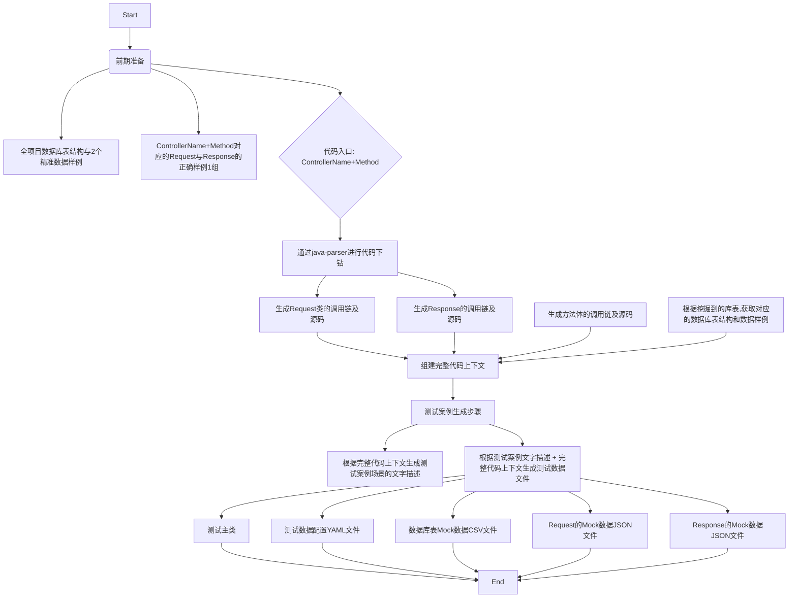

```mermaid
graph TD
    A[Start] --> B(前期准备);

    B --> B1[全项目数据库表结构与2个精准数据样例];
    B --> B2[ControllerName+Method对应的Request与Response的正确样例1组];

    B --> C{代码入口: ControllerName+Method};

    C --> D[通过java-parser进行代码下钻];

    D --> D1[生成Request类的调用链及源码];
    D --> D2[生成Response的调用链及源码];
    D3[生成方法体的调用链及源码];
    D4[根据挖掘到的库表,获取对应的数据库表结构和数据样例];

    D1 & D2 & D3 & D4 --> E[组建完整代码上下文];

    E --> F[测试案例生成步骤];

    F --> F1[根据完整代码上下文生成测试案例场景的文字描述];
    F --> F2[根据测试案例文字描述 + 完整代码上下文生成测试数据文件];

    F2 --> F2a[测试主类];
    F2 --> F2b[测试数据配置YAML文件];
    F2 --> F2c[数据库表Mock数据CSV文件];
    F2 --> F2d[Request的Mock数据JSON文件];
    F2 --> F2e[Response的Mock数据JSON文件];

    F2a & F2b & F2c & F2d & F2e --> G[End];
```
